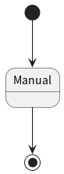

# UML
## ステートマシン図
ステートに関してはメインステートとサブステートの2種類を用意する。  
メインステートはイベント駆動のものを、サブステートはイベント駆動というよりかは実装寄り(粒度細かめ)なものにする。  
サブステートの粒度を実装寄り(細かく)するのは、組み込みシステムの場合は粒度が実装寄り(細かい)ほうが分かりやすく、デバッグもしやすいため。  

メインステートの遷移はサーバー側が各基板のステートを監視しながら、サーバーから各基板のメインステートを操作する。  
サブステートは各基板内の判断で自動で遷移される。  
メインステートがManualのときは人間がスマホからすべてを操作するため、自動での遷移は行われない。  
すべてサーバーから遷移させる必要がある。  

全体のステートマシン図  
  

## Rat
Idle  
  
Search  
  
CaughtByCat  
  
Feed  
  
Manual  

